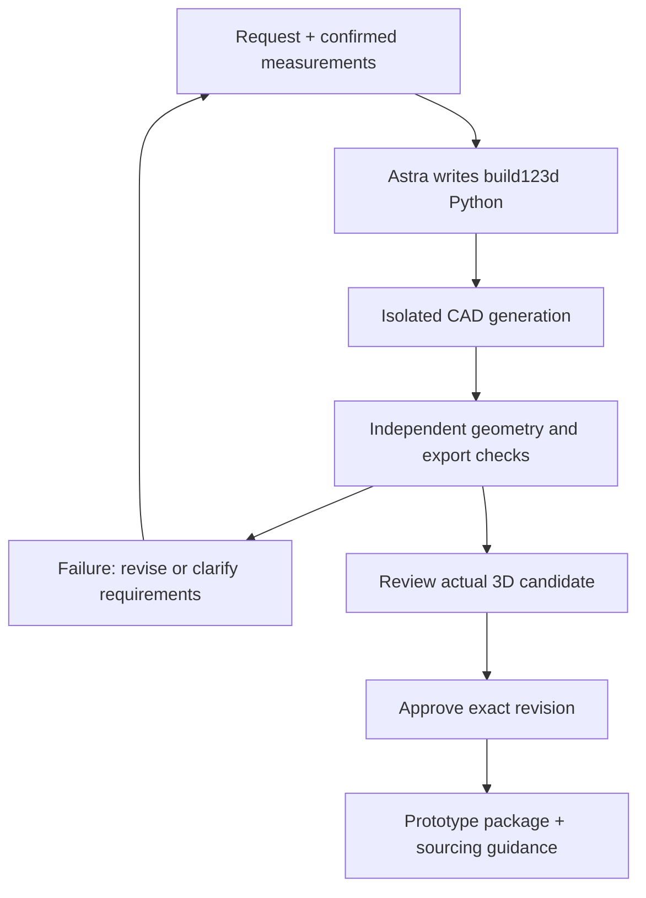

# WorldKinetics

**Prompt to product.** Customize everyday physical products without learning CAD.

**Repair it. Make it fit. Make it yours.**

Keep the cabinet you love. Replace or personalize its handle using confirmed measurements, review the changes, and prepare a prototype. Photos alone cannot establish accurate dimensions.

[Website](https://worldkinetics.app/) · [Watch the demo](https://worldkinetics.app/demo/) · [Explore the approved 3D example](https://worldkinetics.app/workspace/?mode=handle-demo)

The public saved demo lets you compare Before and Your design, rotate the actual geometry and download approved files. It replays a real local result without generating a new design. Public live generation is not yet available.


*Earlier September 8 homepage capture. The live site has since gained the recorded demo and saved 3D workspace.*

## Cabinet handle demo

The completed September 8 curved-handle demonstration at [`5be4b7a`](https://github.com/benikigai/worldkinetic/commit/5be4b7a5c8211a8eb4b537c20bc60766378cce32) uses actual Astra-authored build123d Python. Initial generation passed eight checks; grip/thumb-rest refinement passed nine. Both revisions were explicitly approved. The final design retained 96 mm mounting pitch, measured 29.568 mm finger clearance and 110 mm overall length. Browser-downloaded STEP, STL and editable Python matched the accepted manifest.

The public saved workspace includes this curved result and its complete prototype ZIP. These earlier screenshots show the previous straight-handle demonstration, not the latest curved design:

| Earlier accepted handle | Earlier refinement under review |
| --- | --- |
|  |  |

*The pictured refinement was subsequently approved. These checks do not establish physical fit or strength.*

## Why WorldKinetics?

**More than a model. A design you can check.**

Astra proposes the design; WorldKinetics manages the requirements, evidence and approval:

- **Keep what fits:** preserve confirmed dimensions and protected geometry.
- **See what changed:** inspect actual exports in a before-and-after comparison.
- **Check before you make:** review independent measurements, approve the exact revision and download its checked files.

The model cannot change checks, lower thresholds or accept a candidate. Missing, failed or stale evidence blocks acceptance. The broader consumer experience remains planned beyond this bounded handle workflow.



## From approved design to physical part

The handoff ZIP contains exact approved STEP/STL, editable Python with its reference dependency, requirements, check results, a hash manifest and a prototype brief. The Make your part workflow adds self-printing guidance or supplier-quote preparation for manufacturer review.

Supplier references include Craftcloud, Xometry and Protolabs. Prices and lead times require a quote. There is no automatic supplier upload, order or fabrication. Printing requires printer-specific slicing; no generic G-code is supplied. Mounting hardware, threads, material suitability and physical testing still need review.

## Everyday possibilities

These illustrative workflows are not all implemented:

- **Repair:** replace a cabinet handle while retaining its mounting interface.
- **Make it fit:** design a vacuum adapter from measured ends, insertion depths and clearance.
- **Make it yours:** add a tactile keyboard/control grip after measuring attachment, neighboring geometry and travel.


*AI-generated sample brief, not a measured part. Panel clearance holes do not specify handle threads.*

## Current evidence and limits

The working stack is Astra Responses API, build123d/Open CASCADE, isolated Docker jobs, TypeScript/Zod and a Three.js viewer. Astra also assisted development through Codex; [development evidence](docs/development-evidence.md) distinguishes earlier wrapper runs from subsequent direct work.

Successful recorded runs do not establish repeatability for arbitrary requests. A subsequent fresh local refinement hit the STL triangle cap before checks completed; it did not produce an approved revision. Photo reconstruction, voice interaction, FEA, manufacturing certification and general-purpose CAD are not demonstrated.

Historical local API evidence at `0311706` used numeric planning, not model-authored Python: a 30 mm plate failed its margin check; a separately confirmed 36 mm requirement passed. The scaffold snapshot `4090c8166a2e52eb3e16e094d42c7bd1423407a8` predates the connected handle workflow. See [provenance](docs/provenance.md#evidence-snapshot) and [plate examples](examples/plate/README.md).

## Run locally

Requires Node.js 22+:

```sh
npm ci
npm run build
npm start
```

Open [localhost:4310](http://127.0.0.1:4310); `/workspace/?mode=handle-demo` opens the saved example. New generation additionally requires a server-side `OPENAI_API_KEY`, Python, Docker and the expected [CAD runtime](src/tools/README.md). The default backend selects the plate; handle mode needs `WORLDKINETICS_DESIGN=handle` and a valid `WORLDKINETICS_HANDLE_REFERENCE_DIR` containing `reference.step`, `preview.stl` and `datums.json`.

```sh
npm run typecheck
npm test
```

These tests do not establish complete live CAD/browser behavior. Use separate `PORT` and `WORLDKINETICS_RUNTIME_DIR` values per instance. Export [.env.example](.env.example) settings in the shell; `.env` is not automatically loaded. Keep credentials and raw logs private.

[Architecture](docs/architecture.md) · [Build plan and ownership](docs/build-plan.md#roles-and-exclusive-paths) · [Backend notes](docs/backend-scaffold.md)

Project source is [MIT licensed](LICENSE). Dependencies retain their own terms.
