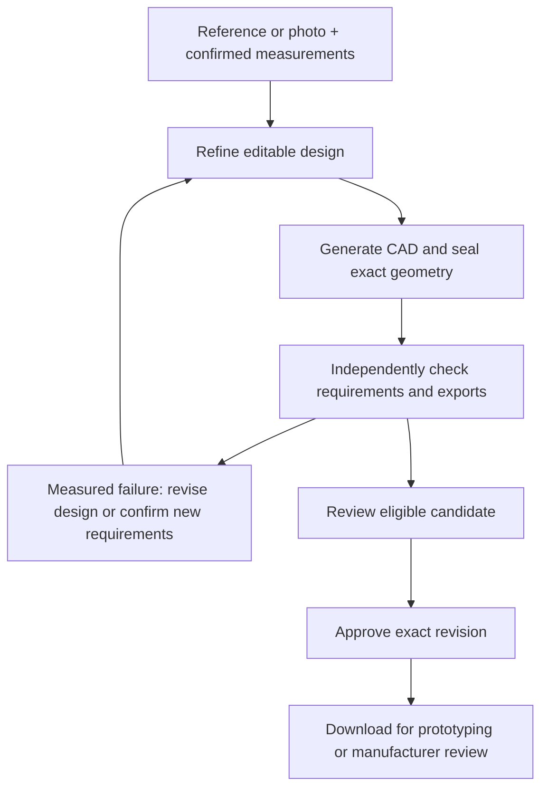

# WorldKinetics

**Prompt to product.**

Design and customize physical products without learning CAD.

**Repair it. Make it fit. Make it yours.**

Start with a reference or photo plus confirmed measurements, refine an editable design, independently check requirements, approve the exact revision, and download files for prototyping or manufacturer review. Photos alone cannot establish accurate dimensions.

[worldkinetics.app](https://worldkinetics.app) is the live design preview. The public interactive demo is not yet live.

## Everyday possibilities

These are three illustrative planned workflows, not all implemented:

- **Repair a cabinet handle:** use the existing handle as a reference, confirm mount spacing and fastener dimensions, then reshape the grip while preserving the mounting interface.
- **Make a vacuum adapter fit:** measure both connecting ends, confirm insertion depths and clearance, then refine an adapter that connects those measured interfaces.
- **Make a tactile keyboard or control grip yours:** explore a texture or shape that is easier to locate by touch. Measure the attachment separately, along with neighboring geometry and moving-part clearance, before designing the grip.

## Intended workflow

This diagram describes the intended product path, beyond the current numeric plate demonstration.



The model cannot change checks, lower thresholds or accept a candidate. Failed or incomplete required evidence blocks acceptance. Generated, checked, accepted, exported and physically tested are separate states. Downloads must preserve the exact checked files and revision identity.

## Why WorldKinetics?

**More than a model. A design you can check.**

Astra proposes designs. WorldKinetics is building toward a guided, checkable workflow around those proposals:

- **Keep what fits:** preserve confirmed measurements and requirements as you refine a design.
- **See what changed:** make targeted edits and review a before-and-after comparison.
- **Check before you make:** review independent measured checks, give explicit approval for the exact revision, and export that revision's checked files.

These describe the intended experience; the evidence below covers the narrower numeric plate demonstration.

## Current evidence and limits

Owner-reported evidence is pinned to [`0311706879b29810cb4bca56ece32a10bdea294e`](https://github.com/benikigai/worldkinetic/commit/0311706879b29810cb4bca56ece32a10bdea294e), September 8, 2026, around 14:00 PDT:

- A local API run used actual `gpt-6-astra` Responses numeric planning plus real CAD. This was not model-authored Python.
- A 30 mm plate was rejected because its measured 2 mm end margin fell below the unchanged 5 mm requirement.
- After confirming a 36 mm requirement, the new candidate passed seven required checks with a 5 mm end margin. This did not satisfy the original 30 mm request.
- API acceptance and exact source, editable Python, STEP and STL downloads were verified in that local run.

This is local API evidence, not live browser verification or physical fit proof. The consumer examples above, general model-authored CAD, full conversational refinement and public interactive access remain planned. No strength, printing, simulation or manufacturing certification is established. Supplier upload, ordering, fabrication and submission require separate authorization.

## Run locally

Requires Node.js 22 or newer:

```sh
npm ci
npm run build
npm start
```

Open [localhost:4310](http://127.0.0.1:4310) for the local design preview. `/api/bootstrap` reports configured scope and readiness. The current server selects the plate baseline; numeric execution also requires a server-side `OPENAI_API_KEY`, Python 3.9+, Docker and the expected local CAD image. See [CAD runtime prerequisites and limits](src/tools/README.md). The npm commands do not provision that image.

```sh
npm run typecheck
npm test
```

`npm test` exercises backend behavior with synthetic adapters and provider responses; it does not establish the complete CAD or browser workflow. `npm run dev` watches server changes; rebuild static assets with `npm run build`.

Use a private `PORT` and `WORLDKINETICS_RUNTIME_DIR` for each development instance. [.env.example](.env.example) lists settings; export variables in your shell because the server does not automatically load `.env`. Keep credentials and raw provider/runtime logs private.

## Historical snapshot and documentation

The older snapshot at `4090c8166a2e52eb3e16e094d42c7bd1423407a8`, September 8, 2026, around 13:14 PDT, contained a tested scaffold and separate local capability proofs. Integrated CAD, workspace review and explicit acceptance were pending at that time. Those historical statuses do not describe the newer owner-reported run above.

- [Architecture and diagrams](docs/architecture.md): intended trust boundaries, requirements and acceptance.
- [Build plan](docs/build-plan.md): milestones and [contributor ownership](docs/build-plan.md#roles-and-exclusive-paths).
- [Backend scaffold](docs/backend-scaffold.md): transport and adapter notes with historical planning statuses.
- [Plate examples](examples/plate/README.md): preserved FreeCAD files, STEP/STL exports and sanitized measurements.
- [Provenance and historical evidence](docs/provenance.md#evidence-snapshot): attribution and revision-specific limits.

Document checks cover structure and links, not factual or runtime claims; source and product review remain separate.

Project source is [MIT licensed](LICENSE). External dependencies and services retain their own terms.
