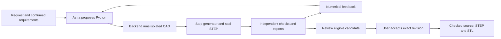

# WorldKinetics

Customize an accessory you own without learning CAD. WorldKinetics is a prototype for turning a requested change into an editable part while preserving known interfaces and independently checking the resulting geometry. Built during the September 8, 2026 Astra hackathon.

The first demonstration uses an owned, generated two-hole plate: add a tactile feature while preserving the plate and its open bores. A controller accessory is a later possibility once its attachment, neighboring geometry and travel are measured.

## Current status

**The repository contains a tested scaffold, not a connected CAD product.** The root page is the existing 2D Precision design preview, with its artwork, typography and theme choices. [worldkinetics.app](https://worldkinetics.app) is the prototype site. The separate `/workspace` product surface is being built; its source is not integrated in the documented snapshot.

- **Integrated scaffold:** Node 22, TypeScript and Zod HTTP/run/artifact handling, Three.js dependency wiring, nested static assets and optional workspace bundle support.
- **Separate local proofs:** preserved FreeCAD plate examples; one-shot Responses API access with requested/reported `gpt-6-astra`; isolated build123d generation followed by trusted STEP verification. These do not establish an application workflow.
- **Proposed integration:** generated Python, real CAD adapter, viewer, numerical feedback and repair, explicit user acceptance and exact source/STEP/STL downloads.

The [evidence snapshot](docs/provenance.md#evidence-snapshot) records revisions and limits. Current transport is `wk-backend-draft-0.1`; the target is `wk-prototype-0.2`.

## Intended product path

This diagram describes the proposed integrated workflow. Its individual capability proofs are separate from the running scaffold.



Repair has a bounded attempt budget. The model cannot change checks, lower thresholds or accept a candidate. Failed or incomplete required evidence blocks acceptance.

Optional **Images 2.5** could turn an actual CAD render into a visual concept. Selecting a direction would lead to separately confirmed, explicit requirements and another real CAD/check cycle. This is planned visual intent support; pictures cannot supply dimensions or pass engineering checks.

## Run the scaffold

Requires Node.js 22 or newer.

```sh
npm ci
npm run build
npm start
```

Open [localhost:4310](http://127.0.0.1:4310) for the design preview. `/api/bootstrap` reports configured scope and readiness. The default entry point has no selected design or CAD adapter and reports execution as unavailable.

```sh
npm run typecheck
npm test
```

`npm test` exercises backend/scaffold behavior using synthetic adapters and provider processes. It does not test the complete CAD workflow. `npm run dev` watches server changes; rebuild static assets with `npm run build`.

Use `PORT` and `WORLDKINETICS_RUNTIME_DIR` for a separate development instance. [.env.example](.env.example) lists existing settings; export variables in your shell because the server does not automatically load `.env`. Keep credentials server-side. The optional `npm run verify:astra` command requires an authenticated compatible Codex CLI and can consume account usage. It tests a numeric response, not the proposed Responses API loop.

## Documentation and examples

- [Architecture and diagrams](docs/architecture.md): trust boundaries, requirements, checks and acceptance.
- [Build plan](docs/build-plan.md): milestones, completion criteria and [contributor ownership](docs/build-plan.md#roles-and-exclusive-paths).
- [Backend scaffold](docs/backend-scaffold.md): existing transport and adapter notes; its original planning-status statements are historical.
- [Plate examples](examples/plate/README.md): native FreeCAD files, STEP/STL exports, dimensions and sanitized checks.
- [Provenance](docs/provenance.md): original work, dependencies and scoped evidence.

## Known gaps

The integrated generation/repair loop, complete check registry, workspace viewer and explicit acceptance remain pending. Local runtime packaging is not a published reproducible CAD image. No physical fit, strength, printing, manufacturing certification or simulation is verified. Public live CAD hosting and supplier handoff are also pending.

Project source is [MIT licensed](LICENSE). External dependencies and services retain their own terms.
