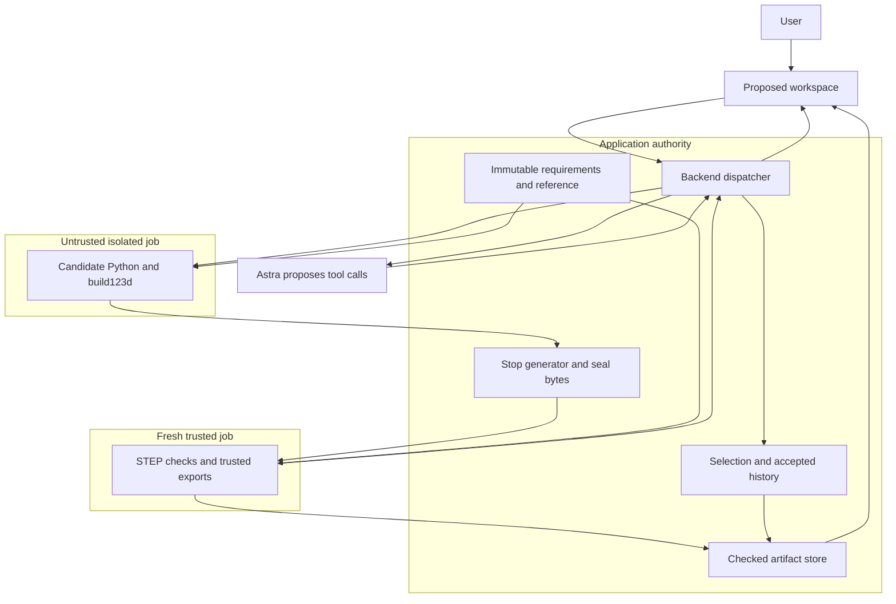
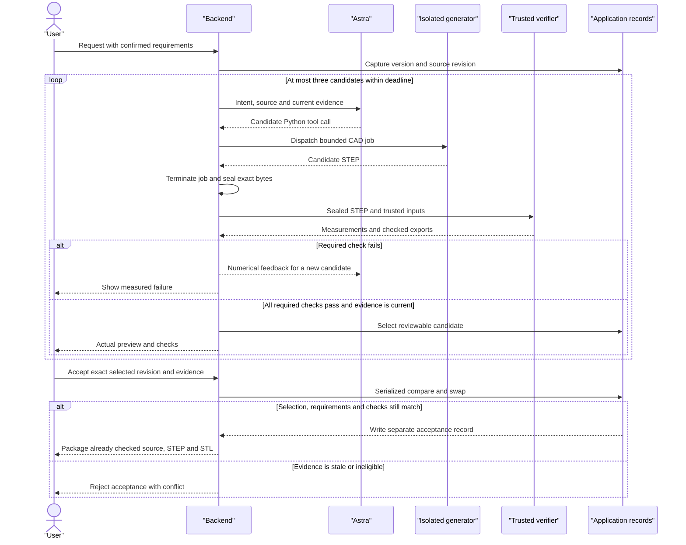
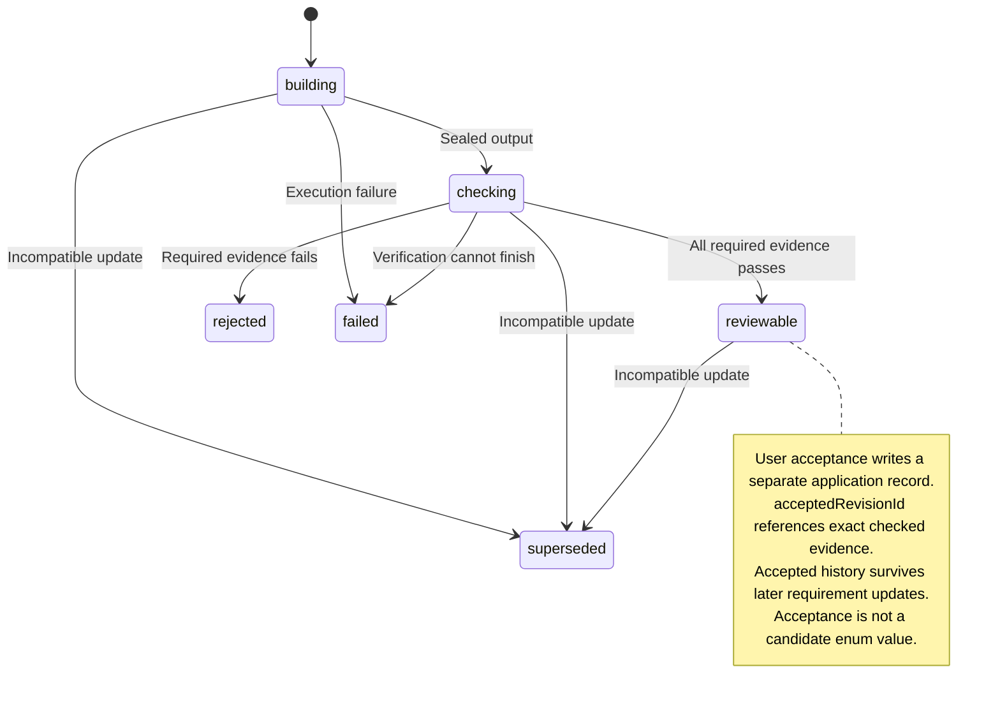

# WorldKinetics architecture

Design `wk-plan-0.2`, September 8, 2026. PLAN-01 semantics are released for implementation. The executable transport remains `wk-backend-draft-0.1`; `wk-prototype-0.2` is the target. All diagrams below describe intended integration, not a completed product run. See the timestamped [evidence snapshot](provenance.md#evidence-snapshot).

## Product and components

Help someone customize an owned accessory while retaining known interfaces and obtaining editable CAD with independent numerical checks. Start with the owned plate and a newly generated tactile feature. Consumer attachment, neighboring geometry and travel must be measured before a controller accessory can become the demonstration. No measured stand reference or physical-fit evidence is established.

| Component | Selected approach | State at the documented snapshot |
| --- | --- | --- |
| Application | Node 22, TypeScript, Zod, atomic JSON state and immutable artifact files | Integrated HTTP/run/artifact scaffold; proposed acceptance migration pending. |
| Landing | Existing 2D Precision layout, artwork, typography and themes | Integrated design preview, preserved separately from the CAD workspace. |
| Workspace | `/workspace`, Three.js 0.186.0, millimeters and Z-up | Dependency and esbuild 0.28.2 bundle wiring integrated; workspace source/viewer not integrated. |
| Product model | `gpt-6-astra` through Responses API | Separate one-shot access passed with matching requested/reported model; orchestration, generation and repair pending. |
| CAD | build123d 0.11.1, cadquery-ocp-novtk 7.9.3.1.1 in a pinned arm64 container | Separate local isolation/geometry proof passed; runtime packaging and product adapter pending. |
| Verification | Fresh trusted invocation against sealed STEP and immutable requirements | Local capability proof passed; complete product check registry pending. |
| Preview feedback | Trusted STL export from checked STEP; fixed isometric/top/side renders | Proposed viewer and capture integration. Candidate HTML/scripts are never rendered. |
| FreeCAD | Preserved native reference examples and inspection | Separate verified examples; build123d does not promise new FCStd history. |
| Images 2.5 | Optional `gpt-image-2.5-flare` visual concepts | Proposed direct API path; separate marketing image experiment is not integration. |
| Native steering | Optional Responses WebSocket continuation | Integrated applied continuation unverified; not a core dependency. |

Current [contracts](../src/shared/contracts.ts), [execution](../src/server/execution.ts) and [store](../src/server/store.ts) implement numeric operations, not candidate Python or explicit user acceptance. A compatible successful tool result advances `currentRevisionId` without requiring all engineering checks to pass. `run.accepted` means a request was admitted, not that a user accepted geometry. The [entry point](../src/server/index.ts) configures no selected design or tool. Build support in [scripts/build.ts](../scripts/build.ts) does not establish a working workspace.

## System and trust boundaries

The application scaffold exists. The model/CAD/check/review connections and new application records shown here are proposed; the CAD boundary has only a separate local capability proof.

Backend dispatches model tool calls and controls job lifetimes. Astra has no direct verifier, filesystem, requirement-update or acceptance authority. The trusted job parses candidate geometry but never runs candidate Python. Generation and verification may use the same CAD library; independence comes from separate execution and authority.

## Request, repair and acceptance

Proposed sequence for a compatible request. Trusted exports and checks finish before review. The backend rechecks applicability on each completion and on acceptance; an incompatible completion stays historical.

Stop generation when a candidate is ready for review, input needs clarification, the attempt/deadline budget is exhausted, or a user update makes work incompatible. A repair creates a new candidate and retains the failed one. Never fabricate a failure or silently substitute fixture geometry.

Proposed candidate states are separate from run status and accepted history:

## Execution and runtime budget

Candidate source uses the existing build123d Python API through a proposed `build_candidate` tool; `inspect_candidate` returns trusted measurements and actual views. No CAD DSL or preset ridge implementation is needed. Candidate payloads cannot replace validators, thresholds, container commands or host paths. [build123d import/export documentation](https://build123d.readthedocs.io/en/stable/import_export.html) describes the STEP/STL interfaces used by the selected engine.

Run generated code in a disposable non-root container with read-only root, no network, credentials, Docker socket or home/project mounts, dropped capabilities and resource limits. Mount only immutable reference inputs and a private output directory. Stop the generator and its remaining processes before sealing output. Reject symlinks, unexpected files, excess output and paths outside that directory. A subprocess or loopback MCP bridge alone is not isolation.

The verifier starts fresh with trusted validator code, immutable requirements/reference and read-only candidate STEP. Candidate measurements are untrusted. Reproduce boundary probes on the packaged runtime: non-root execution, network denial, root/reference write denial, host-access denial and process timeout. Passing the local gate does not certify a public multi-tenant service.

| Proposed budget | Limit |
| --- | --- |
| CAD concurrency | One job at a time, including source regeneration |
| Per-stage deadlines | Generator 60 s; verifier 30 s; renderer 15 s |
| Per-request budget | At most three candidates and 180 s total; stop at the first exhausted limit |
| Input/output | Source 64 KB; artifact output 25 MB; preview 100,000 triangles |

These are initial limits, not measured latency. Provider calls and continuations share the application deadline and available usage budget. There is no authorization to exceed account limits.

## Reference setups and exact checks

The [plate examples](../examples/plate/README.md) preserve the 40 x 30 x 8 mm original and separate revised baseline. The proposed setups below are distinct immutable requirement versions; never apply resize semantics to the fixed feature case.

| Contract item | Exact value or rule |
| --- | --- |
| Baseline | 50 x 35 x 5 mm; one solid; volume 8467.256661176916 mm3 |
| Frame | Millimeters; right-handed; Z-up; X length, Y width; origin at minimum plate corner |
| Bores | Two 6 mm through-bores at (15, 17.5) and (35, 17.5) mm; pitch 20 mm |
| `resize_centered_v1` | Width 35 and thickness 5; centers move to ((L - 20) / 2, 17.5) and ((L + 20) / 2, 17.5); diameter and pitch stay fixed |
| Resize conflict | Requested L = 30 gives analytic end material (L - 20 - 6) / 2 = 2 mm against the 5 mm demo rule. User-confirmed L = 36 gives 5 mm. Never clamp or claim 36 satisfies 30. Generate and measure both candidates. |
| `tactile_feature_v1` | Freeze the 50 x 35 x 5 baseline, all baseline material and both full-extent open bores; allow only the requested addition |
| Allowed addition box | x = 20..30, y = 25..30, z = 5..7 mm |
| Required added geometry | Added spans X = 8..10, Y = 3..5, Z = 2 mm; positive added volume greater than 1 mm3; resulting shape remains one valid solid |
| Appearance preference | Rounded appearance is a preference unless separately measured and confirmed as a requirement |
| Linear tolerance | 0.01 mm |
| Boolean difference tolerance | 0.01 mm3 |
| Reopened volume tolerances | STEP relative error 1e-5; STL relative error 1e-3 |

These are demonstration numerical tolerances and an illustrative margin rule, not manufacturing certification or structural criteria. Full-extent bore keepouts prevent an added feature from capping a hole above the original plate. Evaluate added spans on candidate-minus-baseline geometry, not total part bounds.

Seven base check IDs are required. The feature setup adds two more:

| Check ID | Trusted computation |
| --- | --- |
| `geometry.valid_single_solid` | Reopened geometry is valid, nonempty and exactly one solid. |
| `geometry.requested_dimensions` | Bounds and dimensions match the chosen setup, including its permitted addition. |
| `holes.layout` | Diameter, centers, pitch and open bores match the setup; centered motion is allowed only in resize. |
| `margin.end_material` | Measure hole-to-end material against the unchanged 5 mm demo rule. |
| `export.step_reopen` | Reopen exact sealed STEP; compare geometry and volume within recorded tolerances. |
| `export.stl_reopen` | Read trusted STL; validate byte layout, bounds, volume and required mesh integrity checks. Record units as mm. |
| `export.editable_reopen` | Regenerate delivered source in isolation, stop/seal that job, then compare its geometry in a fresh trusted verifier. |
| `interface.protected_region` | Feature only: Boolean comparison preserves all baseline material and full-extent open bores; disallow changes outside the allowed addition. |
| `feature.requested_change` | Feature only: measure the actual addition's location, spans and positive volume against the table. |

The local capability gate does not prove all these checks are implemented. For `export.editable_reopen`, the backend schedules the isolated regeneration; the verifier never executes candidate Python. Editable build123d delivery means source, parameters when applicable and references. A FreeCAD final-solid document is not automatically parametric history; preserve the actual native histories in the existing examples.

## Requirements, evidence and concurrency

The application owns these proposed records; BACKEND owns their executable schemas and canonical JSON fixtures:

| Record | Required identity and meaning |
| --- | --- |
| Design | Reference identity/hash, `activeRequirementsVersion`, `selectedCandidateRevisionId`, `acceptedRevisionId`, `activeRunId` |
| Requirements | Immutable version and setup hash, units/frame, required check IDs, thresholds, tolerances and protected/keepout geometry |
| Request/run | Idempotent request ID and content; one orchestration run with captured requirements, input source revision and bounded candidate attempts |
| Candidate revision | Unique attempt/revision ID, source hash, requirements/setup identity, engine/image digest and artifact references |
| Check bundle | Candidate revision, requirements/setup version, validator version, exact input STEP hash, methods, measurements, thresholds, units and states |
| Acceptance | Exact selected candidate revision, requirements version and check-bundle hash, recorded atomically by a user action |

Keep candidate STEP byte identity distinct from geometry equivalence. Source, sealed STEP, each export, canonical requirements and check bundle have their own SHA-256 identities. BACKEND supplies canonical JSON encoding and test fixtures; Python consumers verify those supplied canonical bytes instead of using independent default JSON serialization. Checks cannot be reused across changed requirements in this first version.

One failed required check, `not_evaluated`, missing or duplicate ID, unknown check/state, stale result or mismatched identity blocks acceptance. The expected registry comes from trusted requirements. The model cannot edit that registry, lower thresholds or auto-accept.

Requirement updates and acceptance share one serialized compare-and-swap (CAS) state boundary. Acceptance compares expected requirements version, selected candidate and check-bundle identity inside the same transaction that records it. Changed or ineligible evidence returns `409`. An explicit user-confirmed requirement update increments the version and supersedes incompatible work while preserving accepted history. If acceptance wins the race first, it remains historical under the prior requirements; it does not certify the updated design.

Late tool/model completions retain their original request/run/revision identities and cannot replace the current selection or evidence. A changed selection cannot be overwritten by an obsolete completion. Identical retries reuse the original request/run even after a version change; changed content needs a new ID. A new requirement version requires fresh checks and a new eligible candidate before acceptance.

Keep existing run polling, monotonic event IDs and registered artifact endpoints. Add requirements update, exact acceptance and accepted-package operations only through the shared v0.2 migration. BACKEND selects route names and updates all callers/fixtures together. Documentation does not activate routes. The browser shows actual public actions and results, selected candidate versus accepted history, before/after geometry and spatial failure evidence.

## Optional images and native steering

Images 2.5 is optional visual intent support using planned API model `gpt-image-2.5-flare`: actual CAD render -> concept -> user selects direction -> separately confirmed explicit requirements -> generated CAD and independent checks. Keep concepts labeled as images. They neither supply dimensions nor enter geometry acceptance evidence. A separate provider-reported marketing experiment does not establish this direct API path or replace the approved SVG logo. See the official [image generation guide](https://developers.openai.com/api/docs/guides/image-generation) and [Images 2.5 launch](https://openai.com/index/introducing-chatgpt-images-2-5/).

Native steering is optional. The Responses API can queue a mid-turn update, but acknowledgement alone does not prove it was applied. An integrated test must observe the continuation incorporating the update and reject incompatible old results. Steering does not cancel started tools or undo actions; the backend still owns job cancellation and requirements CAS. Reconcile queued input after reconnect before replaying it. Ordinary queued follow-up requests must be labeled as such. See [official steering documentation](https://developers.openai.com/api/docs/guides/steering).

## Export and remaining gates

Before acceptance, trusted code prepares and checks `model.py`, optional `parameters.json`, reference geometry, `part.step`, `part.stl`, `requirements.json`, `checks.json` and revision metadata. The accepted download packages those exact checked bytes with a hash manifest and change summary. It must not perform a new unchecked CAD re-export. Record engine/validator versions, units and exact revision; confirm downloads match their registered hashes.

Required integration evidence remains: one real edit, a newly generated feature, actual failure and repair, preserved original, working viewer, explicit acceptance, reopened exports, stale-result rejection and clean reset/repeat. Physical fit, strength, fabrication, simulation and supplier actions remain unverified. Public live CAD hosting needs a separately tested execution host and access controls; the static preview cannot run the CAD worker. Any replay must be labeled recorded execution.

See [build plan](build-plan.md) for ownership and completion gates and [provenance](provenance.md) for attribution.
