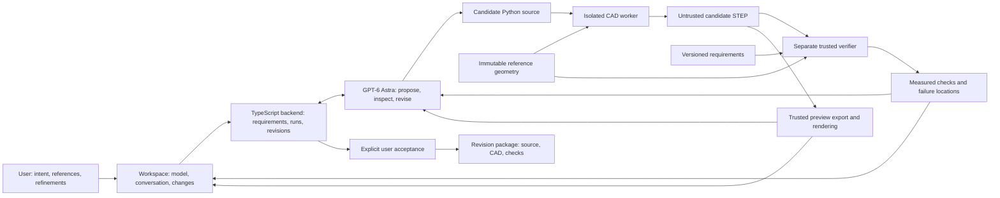

# WorldKinetics architecture

Proposal `wk-plan-0.2`, September 8, 2026. This describes the next prototype. The implemented transport remains `wk-backend-draft-0.1`; a planning document does not enable a disconnected tool or establish a passing product run.

## Product

WorldKinetics lets someone adapt an accessory for an object they own through conversation. Astra creates editable CAD, examines the resulting geometry and rendered views, responds to measured conflicts, and revises the design with the user. Requirements, check evidence and accepted revisions live in the application.

The target experience is: "Make this controller key easier to find by touch. Keep its attachment and leave the neighboring keys usable." A photo identifies the object and intended change. Precise attachment geometry and clearances come from measurements or a reliable dimensional reference.

The first release is one supported accessory, one reference setup and one fabrication profile. Scope the object tightly while allowing Astra to create features through the CAD engine's existing Python API. Avoid making three numeric controls the ceiling of the product.

## Current evidence and next milestone

The TypeScript backend serves a static design preview, validates requests, records runs, handles incompatible completions and registers artifacts. The current provider proposes one numeric operation. It does not implement iterative CAD generation, image feedback or API-native steering. The store currently advances `currentRevisionId` after a compatible successful tool execution; it does not implement explicit human acceptance or require every engineering check to pass. Fix that distinction before presenting a review workflow.

A separate FreeCAD trial created an editable two-hole plate and a revised copy. It checked solid validity, analytical volume, native/STEP reopening and STL integrity. See [CAD examples](../examples/plate/README.md). The product API has not yet called that CAD path.

The next milestone is one browser request producing a real candidate, before/after views, independent measurements, explicit acceptance and usable exports. Reuse the plate as a known integration reference; it is not evidence of consumer-product fit.

## System map

The backend dispatches every operation. The arrows from Astra denote requests, not direct authority over the verifier, application state or user's filesystem.

## Stack decisions

| Area | Proposed decision | Reason and gate |
| --- | --- | --- |
| Application | Existing Node 22, TypeScript and Zod scaffold | Keep the tested state, HTTP and artifact machinery. |
| UI | Existing visual system; a separate `/workspace/` route with Three.js | Preserve the public placeholder's layout, artwork, typography and theme options. Add an actual CAD workspace without replacing it. |
| Product model | `gpt-6-astra` through Responses API | Needed for the selected async/steering experiment; verify event credentials and access first. |
| CAD generation | build123d in a pinned Linux container | It provides a direct Python modeling API and STEP/STL interchange. Pass a clean build/edit/export/reopen test on the actual host before committing to it. |
| Verification | A separate invocation using trusted code and the same pinned CAD library | Independence comes from execution and authority separation. A second geometric kernel is unnecessary for this prototype. |
| Preview | STL geometry in a millimeter, Z-up Three.js scene | Avoid a second mesh conversion path. Generate preview geometry from the same sealed STEP that was checked. |
| Model image feedback | Trusted renderer loads that preview and captures fixed isometric/top/side views | The renderer must not execute candidate HTML or scripts. Test a reusable Playwright/browser capture before depending on it. |
| Storage | Existing atomic JSON state plus immutable local artifact files | One demo operator and serialized state updates do not require a database, Redis or a new queue service. |
| FreeCAD | Existing reference and inspection application | Preserve the working native examples. Do not operate a second product CAD runtime in parallel. |

build123d is a Python modeling framework over OpenCASCADE; its documented export interfaces support this proposal. A local runtime is not yet verified. [build123d](https://build123d.readthedocs.io/en/stable/), [export documentation](https://build123d.readthedocs.io/en/stable/import_export.html).

The build123d source package is Python plus parameters and reference geometry. Importing its STEP into FreeCAD does not reconstruct a native sketch/history tree. Existing FreeCAD examples retain their actual `.FCStd` files; native-history export is not promised for the proposed worker.

At planning inspection Docker CLI and Docker Desktop were installed, but the daemon was unreachable. The first runtime gate is operational, not an invitation to execute generated Python unrestricted on the desktop. If the isolated path fails its timebox, stop adding infrastructure and report the tradeoff: use the trusted, reviewed FreeCAD plate path for a reduced integration demo, or select one other verified isolated runtime. Do not silently label the reduced path autonomous generation.

## The model loop

1. Backend creates a run with the current requirements version, reference identity and selected source revision. It supplies Astra with the request, reference dimensions, protected regions, source code, compact API guidance and available evidence.
2. Astra proposes a candidate program through `build_candidate`. The payload contains Python source and a short public change description. It cannot contain replacement checks, acceptance thresholds, container commands or host paths.
3. The CAD worker executes the candidate in a fresh restricted job and produces STEP. Candidate-generated measurements and "passed" statements are untrusted output.
4. After the generator has exited and its process group/container is gone, trusted code seals the candidate bytes and computes hashes. A fresh verifier imports that STEP without executing the candidate source. Trusted exports and preview views are produced from the sealed geometry.
5. Astra receives numerical checks, spatial failure evidence and actual rendered views. It can call `build_candidate` again with a corrected source. Keep at most three candidates per user request initially, with visible attempts and a total request deadline. Stop on an unresolved input, exhausted budget or incompatible user update.
6. Passing a check makes a candidate eligible for review. Only the user can accept it. Failed candidates remain inspectable and cannot replace the accepted design.

Start with `build_candidate` and `inspect_candidate` (structured dimensions/checks plus rendered views). Add `wait_for_jobs` only when native async tooling is enabled. Requirements edits and acceptance are application/user actions. Do not build a CAD DSL or hundreds of feature wrappers. The fixed transport and trust boundary do not restrict the geometric API to presets.

Initial proposed runtime bounds: one CAD mutation at a time; generator 60 seconds, verifier 30 seconds, renderer 15 seconds; three attempts and 180 seconds total per request; 64 KB source, 25 MB artifact output, 100,000 preview triangles. These are prototype limits to tune from the first real run, not measured performance or user spending authorization. Provider requests must also obey available token/credit limits.

## Execution boundary

Generated code runs in a disposable non-root container with a read-only root filesystem, no network, no credentials, no Docker socket, no home/project mounts, dropped capabilities and resource limits. Mount only its immutable reference inputs and private output directory. Candidate code cannot write requirements, validator code, another run or accepted artifacts. Build the image from reviewed dependency declarations, record its digest and use one engine version for generation and verification.

Run the verifier in a fresh container with trusted validator code, trusted requirements/reference inputs and the candidate geometry mounted read-only. Stop the generator before verification to prevent changes between checking and export. Reject symlinks, excess outputs, unexpected file types and files outside the assigned directory. Treat CAD parsing as untrusted input too. Container controls and limits are documented by Docker; their actual enforcement must be tested on the chosen host. [Docker execution controls](https://docs.docker.com/engine/containers/run/).

Required boundary probes: attempts to read a host sentinel, write the reference, use the network, leave background work running or exceed the deadline fail; a valid model still completes. No test should contain real credentials. This is a gated prototype runner, not a claim of hardened public multi-tenant execution.

## Reference and checks

Canonical integration baseline: `examples/plate/revised/plate-50x35x5.FCStd` and matching STEP. Dimensions 50 x 35 x 5 mm; two 6 mm through-holes; centers (15, 17.5) and (35, 17.5) mm; spacing 20 mm; volume 8467.256661176916 mm3. Preserve the separate 40 x 30 x 8 mm original. build123d can reconstruct this simple reference from exact supplied dimensions and must match the expected geometry/volume before further edits.

For the first conflict test explicitly establish minimum hole-to-edge material of 5 mm. Request length 30 mm while preserving hole diameter, centering and spacing. Measured end material must be 2 mm, so the candidate fails. The minimum compliant length is 36 mm. This threshold is a design requirement for the demonstration, not a structural strength criterion. The proposed correction must be generated and rechecked; no canned failure badge or cached success.

After integration, prefer the Codex Micro tactile keycap if a measured attachment, complete neighboring geometry and travel envelope are available. Use a 20-minute initial reference gate. If missing, decide with the user on the existing measured-stand fallback; do not invent either geometry or silently switch the product. The plate can continue unblocking integration during that decision.

| Check | Computation and evidence | Acceptance meaning |
| --- | --- | --- |
| Geometry | Reimported valid nonempty solid, expected solid count, bounds, volume; requested numeric dimensions when specified | Numerical geometry validity, not physical strength. |
| Protected interface | Compare candidate geometry clipped to a trusted protected region against the baseline using Boolean differences and appropriate geometric tolerances | Interface geometry preserved within recorded numerical tolerances. Do not rely on an object label or candidate report. |
| Clearance / hole margin | Distance/intersection against trusted keep-out geometry; keycap motion uses an established swept envelope or explicitly bounded sampling method | Pass only for the checked setup. Include measured distance, threshold, units and closest-point/region evidence. |
| Fabrication features | Check supported feature dimensions against a named, versioned process profile | The first profile and numeric thresholds must be confirmed or labeled illustrative; unsupported global thin-wall checks remain not evaluated. |
| Exports | Reopen STEP, compare geometry/volume; validate STL connectivity/winding/volume; regenerate preview from checked shape | Files correspond to the checked revision and are usable in the tested readers. STL units are explicitly millimeters. |

Mandatory checks block acceptance if failed or not evaluated. Optional physical-fit, comfort and printing outcomes have separate unverified states and do not masquerade as geometry passes. The user may explicitly revise a requirement, creating a new version; Astra may not lower a threshold to repair a candidate. No FEA is required for a tactile feature. Add simulation only after a real load case, material, supports and validation method justify it.

## Revision and evidence contract

BACKEND owns the executable migration from `wk-backend-draft-0.1` to proposed `wk-prototype-0.2`. Retain request idempotency, strict schemas, private artifact registration and monotonic events. Extend them narrowly:

- `Design`: reference identity/hash, `activeRequirementsVersion`, `acceptedRevisionId`, `selectedCandidateRevisionId` and `activeRunId`. Generation completion changes the candidate selection, never the accepted revision.
- `Requirements`: immutable version, units, reference/setup hash, named checks, thresholds/tolerances, protected/keep-out regions and whether each check is required. Store proposed requirement changes separately until the user confirms consequential changes.
- `Candidate`: source revision, requirements version, source hash, engine/image digest, attempt ID, artifact IDs and `building | checking | reviewable | rejected | superseded | failed`. User acceptance is a separate atomic record.
- `CheckResult`: candidate revision, requirements/setup version, validator version, input geometry hash, method, measured value, threshold, units, state and optional `pointPair`/`box` region in the shared millimeter frame. Whole-object findings need no invented highlight.
- `Acceptance`: exact candidate revision, requirements version and check-bundle hash. Accept only the current eligible candidate with all required checks passed; stale or changed evidence returns `409`.

A requirement update increments the version immediately, marks incompatible pending work historical/superseded and leaves accepted history intact. Old jobs may finish, but their results cannot become evidence for the new requirements. Do not cache check passage in this first version. A changed requirement needs fresh verification. An accepted historical model may cease to satisfy the latest requirements; display that distinction.

Keep `/api/runs`, run polling and registered artifact endpoints. Add only the needed operations: update design requirements, accept an exact revision, export an accepted revision, and steer a pending run. BACKEND chooses exact route names and migrates every fixture/caller atomically. The old numeric operation can remain for the integration fixture, but generated source needs a separate discriminated payload instead of being hidden inside numeric parameters.

Browser/model progress comes from real events such as candidate started, geometry available, check completed and candidate superseded. Show public action descriptions and actual tool results, not fabricated internal reasoning.

## Astra experiments

| Experiment | Observable test | Status at planning |
| --- | --- | --- |
| New geometry | Ask for a raised tactile feature or cable relief that has no prewritten feature implementation; check it exists and preserves the protected region | Not tested in the product. |
| Feedback repair | Generate an invalid candidate, return unchanged verifier results and actual views, then obtain a valid correction | Not tested in the product. |
| Async tools | Dispatch a real CAD/check job; answer an independent question while it runs; consume its later result under the original call identity | Documented Astra feature; local product access unverified. |
| Mid-turn steering | Change requirements during a pending response/job; continue with the update and prevent obsolete results from being accepted | Documented Astra feature; local product access unverified. |
| Reasoning effort change | Use higher effort for a difficult repair while retaining conversation context | Optional after the core loop; do not spend the demo on configuration. |

Async tools do not execute our workers or manage their lifecycle. Mid-turn steering over Responses WebSockets does not undo actions or cancel already-started tools, and an accepted steer only means it is queued. Track its acknowledgement, application and any disconnect separately. Reconcile queued input after reconnect before replaying it. [Astra guide](https://developers.openai.com/api/docs/guides/latest-model), [async tools](https://developers.openai.com/api/docs/guides/async-tool-calling), [steering](https://developers.openai.com/api/docs/guides/steering).

The existing Codex CLI authentication probe remains useful evidence of a constrained response. It does not verify the API key route, image feedback, async calling or steering. Probe the intended product transport early. If native steering is unavailable, expose ordinary queued follow-up requests honestly and retain application-level supersession. A CLI-based fallback requires its own generation/feedback test; do not describe the existing numeric planner as that fallback already working.

Astra accepts text/image inputs and emits text; voice requires a separate transcription/audio layer. Build text first and treat push-to-talk as a later input convenience. [Model documentation](https://developers.openai.com/api/docs/models/gpt-6-astra).

## Workspace and fabrication handoff

The model occupies the main view. Keep a compact conversation panel, before/after toggle, requirements/checks list, failed-region highlight and candidate history. Distinguish the selected candidate from the accepted revision. The public landing page stays unchanged. Use the existing theme tokens in the new workspace.

The accepted package contains `model.py`, `parameters.json` when applicable, referenced baseline geometry, `part.step`, `part.stl`, `requirements.json`, `checks.json`, `change-summary.md` and a manifest with hashes/units/runtime versions. Add actual orthographic views and a one-part material/process specification once available. Exact drawing dimensions come from geometry; no decorative dimensions. BOM may contain one item. Supplier quoting and ordering are later integrations.

The prototype runs locally first. Before the deadline, choose and verify a separately hosted workspace or a public read-only replay of real exported runs. Hosted execution requires a container-capable host, server-side provider access, an authenticated demo session, request/concurrency limits and a verified HTTPS path. The current static Cloudflare placeholder cannot execute the local CAD worker. Do not expose the desktop bridge or an unrestricted generation endpoint. A replay is labeled recorded execution; it does not establish public live CAD access. Keep the live local demo reproducible in either case.

## Acceptance and scope cuts

Required: one real integrated edit; one newly generated feature beyond a preset resize; one genuine failed requirement and corrected candidate; original preserved; explicit acceptance; export/reopen integrity; late incompatible completion cannot accept/promote; restart/reset does not mix artifacts; working viewer and honest failure states. Run boundary probes before executing model-generated source.

The live demonstration adds a changed requirement while work is pending if the native steering probe passes. Collect timings and attempts from actual runs. They are case results, not model-wide performance claims.

Cut in order when time is short: supplier UI, voice output, dynamic reasoning controls, decorative drawings, extra candidate branches, second object, FEA. Preserve the actual generate/check/revise/review loop and technical evidence. If new-geometry generation or isolation fails, report that reduced scope directly and keep the last working demonstration.

Parallel ownership and the evidence schedule are in [build plan](build-plan.md). Original work and dependency attribution are in [provenance](provenance.md).
