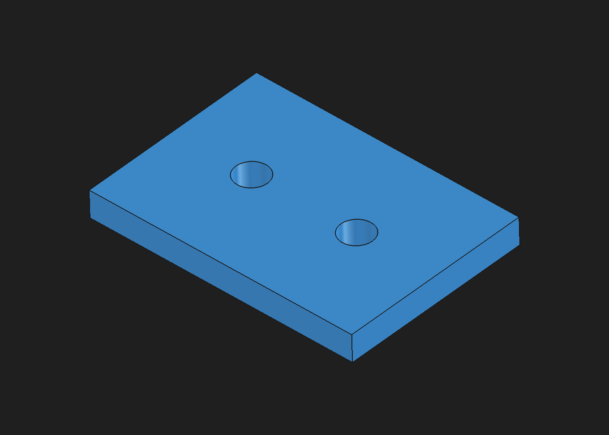

# Plate experiment

Real geometry generated with FreeCAD 1.1.3 through a local MCP bridge on September 8, 2026. This is a separate CAD experiment, not a connected WorldKinetics product feature.

| Property | Original | Revised |
| --- | --- | --- |
| Dimensions | 40 x 30 x 8 mm | 50 x 35 x 5 mm |
| Through-holes | 2 x 6 mm diameter | 2 x 6 mm diameter |
| Hole centers, x/y | (10, 15), (30, 15) mm | (15, 17.5), (35, 17.5) mm |
| Center spacing | 20 mm | 20 mm |
| Volume | 9147.61065788307 mm3 | 8467.256661176916 mm3 |

The original file was preserved with an unchanged SHA-256 hash. The revised hole positions are linked to the plate dimensions and hole depths follow plate thickness. Both native files retain their actual FreeCAD dependency trees.

- [Original FreeCAD](original/mcp-test-plate.FCStd), [STEP](original/mcp-test-plate.step), [STL](original/mcp-test-plate.stl)
- [Revised FreeCAD](revised/plate-50x35x5.FCStd), [STEP](revised/plate-50x35x5.step), [STL](revised/plate-50x35x5.stl)
- [Sanitized measurements and file hashes](verification.json)

Validation established one valid solid, expected dimensions/volume, reopened native and equivalent STEP geometry, and a connected watertight STL with no detected self-intersections. The STL uses millimeters; STL itself does not store units. These checks do not establish strength, printing or physical fit.

`create_original.py` is the original tested smoke script with its output directory changed to be relative to the script. Run it inside FreeCAD's Python environment with `App`, `Gui` and `__file__` defined. It creates a new document, changes thickness from 6 to 8 mm, and writes a timestamped `artifacts/` directory. The portable path adaptation has been syntax-checked but not separately rerun. The included exported files are the actual original experiment files, not newly generated fixtures.

The [provenance note](../../docs/provenance.md) identifies the external application and bridge. No bridge implementation or private execution log is included.
